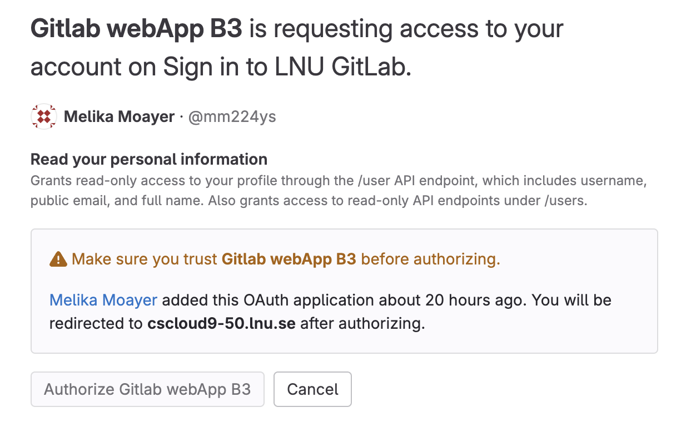
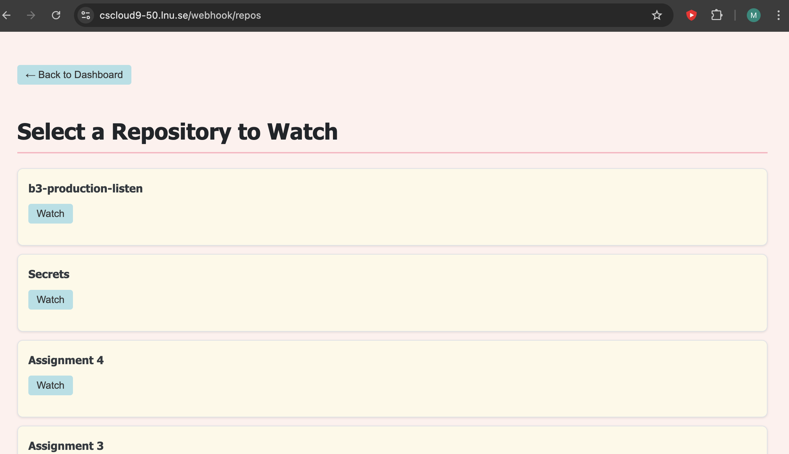
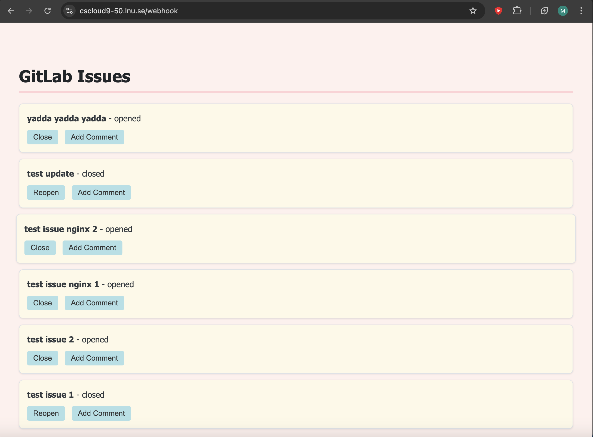
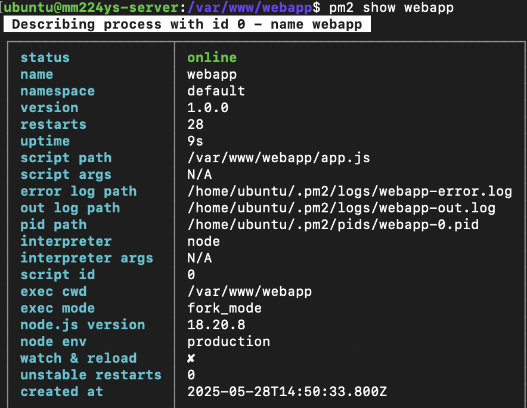
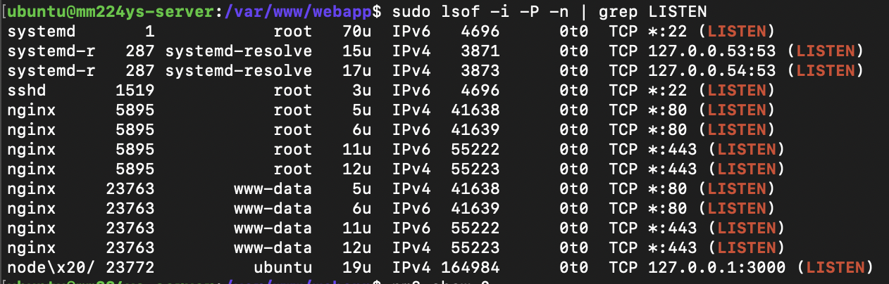

# B3 Production

## Where to find the app:
the application is available on https://cscloud9-50.lnu.se/webhook

## How to access the website:
1. first click on the website
2. now through oAuth you should be redirected to https://cscloud9-50.lnu.se/auth/gitlab/callback
3. in this step you need to provide your lnu gitlab username and password.
4. now you will most likely end up here:

in this step you need to click on "Authorize Gitlab webApp B3"
5. This final step will lead you to the application which should look like this:

6. Now the sad part is that you can only access b3-production-listen repo on this app if you want to access issues, tags, commits and releases. But you can still access that and the page should look like this:

-------------------------------------------------------
## What can you do on the app:
1. On this app you can view GitLab issues, comments, tags and releases for this project: [git@gitlab.lnu.se:1dv528/student/mm224ys/maintainer/b3-production.git](https://)
2. Now the cool part is that you can add comments and close the issues from the same project on the app itself.
3. Furthermore, you can go to the same link from step 1 and create GitLab issues, comments, tags and releases and watch them appear on the website.
----------------------------------------------------
# Implemented features:
### 1. OAuth-protected repo listing from GitLab:
Authenticated users through gitlab can fetch their gitlab repositories and select one to watch via webhooks.
### 2. Dynamic repository selection UI
Lists repositories with a form button to watch (set up webhook on) each repository (but it only works on b3-production-listen, and I am assuming that that's what's intended).
### 3. Webhook creation
 When a user clicks “Watch”, a webhook is registered with GitLab for the selected project (for push, issue, tag_push, and release events) again only on B3-production-listen.
### 4. Dashboard view with live project data
Displays current project issues and extra features like commits, tags, and releases.
### 5. Real time webhook event handling via WebSocket
When GitLab sends webhook events (issues, pushes, tags, releases), they’re forwarded to connected WebSocket clients and shown on the dashboard.
### 6. Issue interaction from the Dashboard (Close, Reopen, Comment)
Users can interact with issues directly from the dashboard using buttons to close, reopen, or comment on them.
### 7. Styling for a pretty UI
The UI is styled with custom CSS for user-friendliness, and visual appeal.
### 8. More about the backend:
- The app.js application has a reversed proxy (Nginx) in the front and it's running through HTTPS.
- The application is running through PM2 and is in production mode:

- The server only listens to ports 80, 443 and 22(ssh). Therefore it is not able to make requests directly to the node application and all requests go through the reversed proxy.

-------------------------------------------------------------

## Note:
- A deployment script (deploy.sh) automates installing dependencies, managing PM2 processes, and reloading Nginx to make deployment repeatable and secure. I added --force since otherwise it doesn't work on my laptop.
- The reason why one can only create webhooks for b3-production-listen repo on this website is since I only configured that repo to send webhooks and my token and permissions are scoped to that repo only. With more time I could do more than only one repo however, due to time limits for now it's only limited to that one repo.